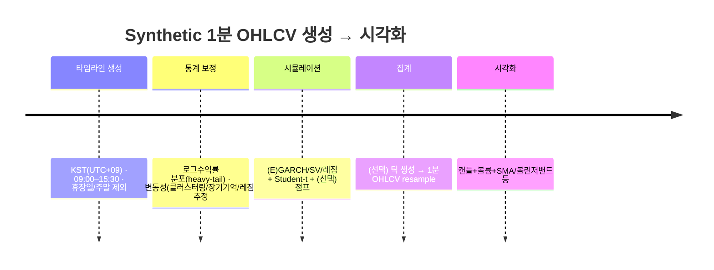

# 코스피200 특성을 모사한 가상 1분 OHLCV 생성 및 시각화 도구·모델 비교 연구

## Executive summary

본 보고서는 **코스피200(KOSPI 200)의 시계열 특성(두꺼운 꼬리·변동성 클러스터링·장기기억·점프/구조변화 가능성 등)에 “그럴듯하게” 맞춘 가상 1분 OHLCV(시가·고가·저가·종가·거래량) 데이터를 생성**하고, 이를 **캔들+볼륨+기술지표(이동평균·볼린저밴드 등)**로 시각화하기 위한 도구/모델을 비교·제안한다. 금융수익률의 보편적 스타일라이즈드 팩트(heavy tails, volatility clustering 등)는 모델 선택의 제약조건으로 활용한다. citeturn5search19

결론적으로, **코스피200의 “단기(분)” 데이터 특성을 모사**하려면 (1) **(E)GARCH 계열 + heavy-tail 혁신항(Student-t) + (필요 시) 점프 혼합 + 장중 계절성(U-자형 변동성/거래량)**을 포함하는 방식이 “구현 난이도 대비 재현력”이 가장 좋다. 이는 코스피200 변동성 예측 연구에서 **EGARCH 등 GARCH류 모형의 경쟁력**이 반복적으로 보고되고, citeturn0search2turn6search34 코스피200 변동성이 **장기기억/비대칭/구조변화(국면전환) 가능성**을 시사하는 연구가 존재하기 때문이다. citeturn6search1turn7view0turn6search18

시각화는 (A) **파이썬 빠른 프로토타이핑/보고서용**이면 Plotly(인터랙티브) 또는 mplfinance(정적·간단) citeturn2search0turn2search21, (B) **웹 서비스/대용량 분봉(수만~수십만+ 포인트) 인터랙티브**이면 Apache ECharts(대용량 렌더링 옵션 내장) 또는 TradingView Lightweight Charts(가벼운 금융차트 전용) citeturn3search7turn2search22, (C) **상용·기능 많은 “Stock chart 패키지”**가 필요하면 Highcharts Stock(유료 라이선스 이슈 주의) citeturn2search3turn3search3가 합리적이다.

또한 본 응답에는 (i) 도구 비교표, (ii) 모델 추천 순위, (iii) 파이썬 중심의 샘플 워크플로우·코드, (iv) 생성된 CSV 샘플(20~50행), (v) 라이브러리별 공식 데모/문서(=시각 자료 역할)를 포함한다.

## 목적, 요구사항/제약, 미지정 가정 정리

목적은 **코스피200 변동을 모사한 가상의 1분 OHLCV**를 만들고(실시간 불필요), 이를 캔들차트와 거래량·기술지표를 포함해 시각화하는 것이다.

요구사항/제약을 “명시/미지정”으로 분해하면 다음과 같다.

데이터 길이는 **미지정**이다. 기본값 제안으로는 (A) “하루 정규장 390개 분봉”, (B) “5영업일(약 1주)”, (C) “20영업일(약 1개월)” 중 목적에 맞게 선택하는 것이 합리적이다(대량 성능 테스트 목적이면 20영업일+ 권장). 정규장 기준 분봉 개수 390은 **09:00~15:30(6.5시간)**을 1분 단위로 나눌 때, **봉 타임스탬프를 ‘봉 시작 시각’(09:00~15:29)**으로 두는 관행을 따른 계산이다(15:29 봉이 15:30에 종료).

거래시간은 “한국 정규장 기준 09:00–15:30 포함”이며 미지정 시 정규장 기준을 따른다. 한국거래소(KRX) 안내 문서(‘Guide to Trading in the Korean Stock Market’)는 정규장(Regular Session) 거래시간을 **09:00–15:30**으로 제시한다. citeturn1search11

휴장/점심시간 처리 역시 미지정이며, 가정은 **점심장 없음**이다(한국 주식 정규장은 일반적으로 중간 휴장 없이 연속 거래). 휴장일은 현실성을 높이려면 KRX의 휴장일 캘린더를 따라야 하며, KRX는 휴장일 조회 페이지를 제공한다(예: 2026년 휴장일 목록). citeturn0search1

분봉 타임스탬프는 **한국 표준시(KST, UTC+09:00)**를 사용한다. 권장 포맷은 (A) ISO 8601 `YYYY-MM-DDTHH:MM:SS+09:00`, 또는 (B) 사람이 읽기 쉬운 `YYYY-MM-DD HH:MM:SS+0900`이다.

중요한 해석상 제약은 **“코스피200은 지수(index)”라 거래량(volume)이 본질적으로 정의되지 않는다**는 점이다. 따라서 본 보고서의 OHLCV에서 `V`는 (1) **코스피200 선물**, (2) **코스피200 추종 ETF(예: KODEX 200 등)**, (3) 또는 “시장 활동 지표”로서의 **합성 거래량** 중 하나로 해석해야 한다. 코스피200은 대표지수로 1994년 개발되어 선물·옵션·ETF 등의 기초지수로 활용된다는 점이 방법론 문서에 명시된다. citeturn12search2turn12search7

## 코스피200 시계열 특성 요약과 합성 데이터 설계 시 함의

### 보편적 스타일라이즈드 팩트와 코스피200 관련 실증 신호

금융자산 수익률(특히 고빈도 포함)의 보편적 성질로는 **(a) 수익률의 fat tails(초과첨도), (b) 변동성 클러스터링(조건부 이분산), (c) (수익률 자체의) 약한 자기상관 vs (절대/제곱수익률의) 지속성** 등이 널리 제시된다. citeturn5search19turn5search3

코스피200 관련 연구들은 다음과 같은 ‘구체 신호’를 제공한다.

코스피200 변동성에 대해 **EGARCH 등 GARCH류 변동성 추정/예측 성능이 높다**는 비교 결과가 보고된다(여러 변동성 측정치 비교에서 EGARCH가 가장 우수하다는 요지). citeturn0search2turn6search34 이는 합성 데이터에서 **시간에 따라 바뀌는 조건부 분산(heteroscedasticity)**을 기본 구조로 넣어야 함을 시사한다.

코스피200 수익률의 **절대수익률·제곱수익률이 장기기억(long memory) 특성(0 < d < 0.5)을 가진다**는 실증 결과가 있다. citeturn6search1 또한 “한국 주식시장 고빈도 데이터에서 KOSPI200 일중 수익률 변동성의 장기기억과 비대칭을 FIAPARCH 등으로 포착할 수 있다”는 연구도 보고된다. citeturn6search18 따라서 단순 GARCH(짧은 기억)만으로는 부족할 수 있고, **(i) 장기기억 계열(FIGARCH/FIAPARCH) 또는 (ii) 국면전환(regime switching) 또는 (iii) 장기기억을 모사하는 다중 시간스케일 구조(HAR-RV류)**가 후보가 된다.

장기기억 해석에는 “구조 변화가 있을 때 장기기억이 허상(spurious)일 수 있다”는 경고도 중요하다. 한국은행 연구 요약(초록)에서는 KOSPI200 실현변동성과 VKOSPI가 **정상적 장기기억(stationary long memory)** 신호를 보이지만, 구조/국면 변화가 장기기억을 왜곡할 수 있으며, **1일 앞 변동성 예측에서 국면전환 모형이 더 정확**하다는 결과를 제시한다. citeturn7view0 합성 데이터는 “장기기억 vs 국면전환”을 선택하거나 혼합해 재현률을 높이는 전략이 필요하다.

고빈도(일중) 관점에서는 코스피200 일중 수익률에 대해 **점프위험(jump risk)과 이분산성**을 함께 고려해야 한다는 연구(예: 30분 간격 일중 수익률을 사용한 분석)가 존재한다. citeturn6search15 즉, 분봉 수준에서도 “연속 확산(diffusion) + 불연속 점프(jump)” 혼합이 현실감을 높일 수 있다.

### 거래량의 시간대 패턴과 변동성과의 관계

실제 시장에서는 개장/마감 무렵 거래가 집중되는 **U-자형 일중 거래량 패턴**이 여러 시장에서 관찰되며, 국내 연구에서도 시장 개장·마감 시 거래량 집중(U-shape)이 관찰되었다는 기술이 있다. citeturn10search12 또한 보편적 스타일라이즈드 팩트로 **거래량–변동성 양(+)의 상관**이 자주 언급된다. citeturn5search3turn5search19 합성 데이터에서 `volume`은 (1) **시간대 계절성(U-shape)**, (2) **|수익률| 또는 조건부 변동성에 대한 의존성**을 결합하는 것이 설득력 있다.

### 합성 데이터 설계로의 번역

요약하면 “코스피200스러운 분봉 데이터”를 만들려면 다음을 동시에 만족시키는 것이 목표가 된다.

로그수익률 분포는 정규보다 두꺼운 꼬리(예: Student-t 혁신항)와 때때로 큰 점프를 허용해야 한다. citeturn5search19turn6search15  
변동성은 시간에 따라 군집을 이루고, 코스피200에서는 장기기억 또는 구조변화(국면전환) 가능성까지 고려한다. citeturn6search1turn7view0turn6search18  
거래량은 U-자형 계절성과 vol–volume 상관을 포함하는 것이 바람직하다. citeturn10search12turn5search3

## 차트 표시 도구 비교 분석

### 비교 대상 선정 원칙

요구사항은 “웹/데스크톱/파이썬 라이브러리 포함”이며, 최소 5개 도구를 비교해야 한다. 본 보고서는 실제 구현 가능성과 라이선스·성능을 고려해 **Plotly, mplfinance, Bokeh, Apache ECharts, Highcharts Stock, TradingView Lightweight Charts**를 핵심 비교 대상으로 삼고, 추가로 “분석/사용자 관점의 데스크톱 차트 도구”로 TradingView Desktop을 참고로 다룬다. citeturn2search0turn2search21turn4search0turn3search0turn3search3turn2search22turn11search3

### 도구별 특성 비교표

아래 표는 “가상 1분 OHLCV를 대량(수만~수십만 분봉)으로 다루며, 캔들·볼륨·지표를 그린다”는 목적에 직접 연관된 기준으로 정리했다.

| 도구 | 형태 | 설치/배포 | 라이선스/비용 | 장점 | 단점/주의 | 대량 분봉(성능) 관점 | 시각 자료(공식 예제/데모) |
|---|---|---|---|---|---|---|---|
| Plotly (plotly.py / plotly.js) | Python + Web(HTML) | `pip install plotly` 등(PyPI) citeturn4search9 | MIT(오픈소스) citeturn4search5turn4search2 | 파이썬에서 인터랙티브 캔들 제공, HTML로 손쉽게 공유; Candlestick trace 공식 API 제공 citeturn2search0turn13search0 | 캔들 차트는 포인트 수가 많아지면 브라우저 부담 가능(다운샘플링/집계 필요할 수 있음); 대용량 최적화는 데이터 전달 방식(NumPy 등)·다운샘플링 도구 활용 필요 citeturn13search1turn13search24 | 대용량은 NumPy/Polars 등 “배열 친화 포맷” 권장 citeturn13search1; WebGL 가속(Scattergl 등)은 일부 트레이스에서 활용 가능 citeturn13search13turn13search5 | Candlestick 공식 문서 citeturn2search0 |
| mplfinance | Python(정적 중심) | `pip install --upgrade mplfinance` citeturn2search21 | Matplotlib 계열 오픈 라이선스(퍼미시브) citeturn2search1 | 금융차트에 특화된 간단 API(캔들, 거래량, 이동평균 등), 보고서/백테스트 결과 이미지 생성에 적합 citeturn2search21 | 기본은 정적(인터랙티브는 제한적) | 수만 분봉까지는 오프라인 이미지로 무난, 그러나 “브라우저 인터랙션”이 목적이면 부적합 | 프로젝트/설치 안내 citeturn2search21 |
| Bokeh | Python → 브라우저(인터랙티브) | `pip/conda`(conda-forge 등) citeturn3search28 | BSD 3-Clause(퍼미시브) citeturn3search2 | 공식 candlestick 예제가 있고(여러 glyph 조합), 브라우저 인터랙션(줌/팬 등) 제공 citeturn4search0 | “앱 형태(Bokeh server)”로 갈수록 배포 구조가 복잡해질 수 있음 | Datashader 연동 시 “매우 큰 데이터셋도 인터랙티브 표시(줌/팬 시 재렌더)” 가능 citeturn4search17turn4search3 | 공식 Candlestick 예제 citeturn4search0 |
| Apache ECharts | Web(JS/TS) | `<script>` 또는 npm 등 citeturn3search26turn13search18 | Apache 2.0 citeturn3search1turn3search19 | 브라우저에서 강력한 인터랙션; 캔들 예제 제공 citeturn3search0; Canvas/SVG 등 렌더러 선택 가능(대량 데이터에 Canvas 유리) citeturn13search30 | 웹 프론트엔드 구현 역량 필요 | 캔들 시리즈에 `large`, `progressive`, `largeThreshold` 등 대용량 처리 옵션이 기본값으로 존재 citeturn3search7 | Candlestick 예제(온라인 편집기) citeturn3search0 |
| Highcharts Stock | Web(JS) | npm/스크립트 포함; 데모·샘플 풍부 citeturn3search29turn3search3 | 상용 라이선스(프로젝트 출시/상업적 사용 시 구매 필요) citeturn2search3turn13search25 | Stock 도메인 기능(내비게이터, 스크롤, 테크니컬 인디케이터 데모 등)과 레퍼런스가 강함 citeturn3search29turn3search3 | 라이선스 비용/컴플라이언스가 핵심 리스크(사내·SaaS는 유료 범주일 가능성 높음) citeturn2search3turn2search11 | Boost 모듈은 WebGL 기반으로 대량 포인트 렌더링을 목표로 하며 트레이드오프 존재 citeturn13search29turn13search2 | Candlestick 데모 citeturn3search3 |
| TradingView Lightweight Charts | Web(JS/TS) | npm 또는 번들; 문서/예제 제공 citeturn2search10turn2search34 | Apache 2.0(오픈소스) citeturn2search2turn2search6 | 금융차트 전용, “작고 빠른” 라이브러리를 표방(예: 45KB 언급) citeturn2search22 | 고급 지표/복잡한 레이아웃은 직접 구현 범위가 늘 수 있음 | 성능/경량을 강점으로 내세움(대량 분봉 표시 시 유리한 선택지) citeturn2search22turn2search2 | 문서(예제 포함) citeturn2search10 |

### 데스크톱 차트 도구 참고: TradingView Desktop

“데이터 생성·시각화 결과를 사람이 탐색·검증하는 용도”라면 TradingView Desktop도 유용하다. TradingView는 데스크톱 앱을 공식 제공하며, 클라우드 기능과 데스크톱 경험을 결합한다고 설명한다. citeturn11search3 다만 이는 “내 데이터로 커스텀 차트를 서비스에 임베드”하는 라이브러리와는 성격이 다르며, 임베딩 목적이면 Lightweight Charts(오픈소스) citeturn2search2turn11search14 또는 Highcharts/ECharts 등으로 구분해 선택해야 한다.

### 예제 코드 스니펫

파이썬 예제는 Plotly 공식 캔들 차트 사용법을 기반으로 한다. citeturn2search0turn13search0

```python
import pandas as pd
import plotly.graph_objects as go
from plotly.subplots import make_subplots

# df: index=KST timestamp, columns=['open','high','low','close','volume'] 형태라고 가정
df = pd.read_csv("synthetic_1m.csv", parse_dates=["timestamp"]).set_index("timestamp")

# 보조지표
df["sma20"] = df["close"].rolling(20).mean()
ma = df["close"].rolling(20).mean()
sd = df["close"].rolling(20).std()
df["bb_u"] = ma + 2*sd
df["bb_l"] = ma - 2*sd

fig = make_subplots(rows=2, cols=1, shared_xaxes=True, row_heights=[0.7, 0.3])

fig.add_trace(go.Candlestick(
    x=df.index, open=df["open"], high=df["high"], low=df["low"], close=df["close"],
    name="OHLC"
), row=1, col=1)

fig.add_trace(go.Scatter(x=df.index, y=df["sma20"], mode="lines", name="SMA(20)"), row=1, col=1)
fig.add_trace(go.Scatter(x=df.index, y=df["bb_u"], mode="lines", name="BB Upper"), row=1, col=1)
fig.add_trace(go.Scatter(x=df.index, y=df["bb_l"], mode="lines", name="BB Lower"), row=1, col=1)

fig.add_trace(go.Bar(x=df.index, y=df["volume"], name="Volume"), row=2, col=1)

fig.update_layout(title="Synthetic 1m OHLCV", xaxis_rangeslider_visible=False)
fig.show()
```

자바스크립트 예제는 Apache ECharts의 candlestick 예제 구조( `series.type='candlestick'`, OHLC 배열)와, 기본 초기화 흐름(`echarts.init` → `setOption`)을 따른다. citeturn3search0turn3search26

```html
<div id="chart" style="width: 100%; height: 480px;"></div>
<script src="https://cdn.jsdelivr.net/npm/echarts@5/dist/echarts.min.js"></script>
<script>
  const el = document.getElementById("chart");
  const chart = echarts.init(el);

  // data: [open, close, low, high] 형식(※ ECharts 캔들 기본 차원 정의 참고)
  const x = ["2026-03-06 09:00", "09:01", "09:02", "09:03"];
  const ohlc = [
    [800.5, 801.4, 798.6, 802.4],
    [801.4, 801.0, 800.2, 802.0],
    [801.0, 802.2, 800.9, 803.3],
    [802.2, 801.6, 801.2, 803.0],
  ];

  const option = {
    xAxis: { type: "category", data: x, scale: true },
    yAxis: { scale: true },
    tooltip: { trigger: "axis" },
    series: [{ type: "candlestick", data: ohlc }]
  };

  chart.setOption(option);
</script>
```

## 가상 1분 OHLCV 데이터 생성 알고리즘 후보와 비교

### 모델 후보 총정리

사용자가 요구한 후보(GBM, OU, GARCH, SV, jump-diffusion, agent-based, historical resampling 등)를 “코스피200 분봉 특성 재현” 관점으로 정리하면 다음과 같다.

GBM(Geometric Brownian Motion)은 Black–Scholes 계열의 기본 가정(로그수익률이 i.i.d. 정규, 변동성 상수)에 가깝다. 이는 금융수익률의 fat tails·변동성 클러스터링 같은 스타일라이즈드 팩트와 거리가 있어 “베이스라인”으로는 유용하지만, ‘코스피200스러움’은 낮다. citeturn5search19

OU(Ornstein–Uhlenbeck)는 평균회귀 프로세스로, “지수 레벨”에는 부적절할 때가 많지만, 금리·스프레드·변동성(또는 로그변동성) 같은 평균회귀 변수에 자주 사용된다. (OU 자체에 대한 공식 인용은 생략하되, 실무적으로는 변동성/스프레드를 OU로 두는 SV 변형이 흔하다.)

GARCH류는 **조건부 분산이 과거 충격/분산에 의존**하도록 하여 변동성 클러스터링을 포착한다. GARCH(1,1)의 고전적 정의는 Bollerslev(1986)에서 제시된다. citeturn10search3turn10search7 EGARCH는 레버리지/비대칭 효과를 반영하는 대표적 변형이며, EGARCH가 변동성 클러스터링 등 스타일라이즈드 팩트를 포착한다는 설명도 존재한다. citeturn6search9 코스피200 변동성 예측에서 EGARCH가 우수하다는 결과가 보고된 점은 “합성 생성기에서 GARCH 계열이 1순위 후보”가 되는 핵심 근거다. citeturn6search34turn0search2

장기기억 GARCH(FIGARCH/FIAPARCH 등)는 변동성의 장기기억을 직접 모델링한다. KOSPI200 절대/제곱수익률이 장기기억을 보였다는 결과 citeturn6search1 와, 고빈도 KOSPI200의 장기기억·비대칭을 FIAPARCH로 포착했다는 연구 citeturn6search18 가 근거가 된다.

확률적 변동성(SV, 예: Heston)은 변동성이 별도의 확률과정으로 움직이며(보통 평균회귀), 레버리지(가격–변동성 상관)를 포함할 수 있다. Heston(1993) 원문은 상관된 변동성을 포함하는 확률적 변동성 모형의 대표적 근거다. citeturn10search5turn10search13 코스피200에 대해 SV 모형을 고려한 헤지 성과가 우수했다는 국내 연구 요약도 존재한다. citeturn0search6

점프-확산(jump-diffusion, Merton 계열)은 확산(연속) + 포아송 점프(불연속) 혼합으로 급격한 변동을 설명한다. Merton(1976) 설정을 따르는 점프-확산 SDE 형태를 정리한 자료가 존재한다. citeturn10search6 코스피200 일중 수익률에서 점프위험 고려가 중요하다는 연구와도 정합적이다. citeturn6search15

국면전환(Regime-switching) 계열은 구조적 변화/레짐에 따라 변동성(또는 드리프트)이 달라지는 모형이다. 한국은행 연구 요약은 장기기억이 구조변화로 인해 허상일 수 있으며, 국면전환이 1일 앞 예측에서 더 정확하다는 결론을 제시한다. citeturn7view0 “분봉 생성”에서도 (예: 평시/위기, 장중 이벤트 시점) 레짐을 섞으면 더 현실적이다.

과거 리샘플링(bootstrapped historical resampling)은 실제 고빈도 수익률 블록을 재표본추출(블록 부트스트랩)해 분포·자기상관 구조를 최대한 “그대로” 가져온다. 단, 고품질 분봉 원천데이터 접근이 필요하다.

에이전트 기반(ABM)은 미시구조(주문흐름·유동성·전략상호작용)에서 가격/거래량을 생성한다. 가장 현실적일 수 있으나, 구현·검증 비용이 크고 파라미터 식별이 어렵다(연구/시뮬레이터 목적에 적합).

### 모델 추천 순위와 이유

아래 순위는 “코스피200 분봉 특성(heavy-tail, volatility clustering, long memory/구조변화 가능성, 점프 위험)” 재현과 “구현 난이도/실무성”을 함께 고려한 것이다.

가장 추천: **(E)GARCH 또는 GJR-GARCH + Student-t 혁신항 + 장중 계절성 + (필요 시) 점프 혼합**  
이 조합은 KoSPI200 변동성 예측 연구에서 EGARCH 등 GARCH류가 강한 성능을 보인 근거가 있고 citeturn0search2turn6search34, Student-t 혁신항은 fat tails를, GARCH는 변동성 클러스터링을, 계절성은 일중 패턴을, 점프는 급격한 이벤트를 반영한다(코스피200 일중 점프위험 고려 필요성과도 정합). citeturn6search15turn5search19

차선: **확률적 변동성(SV: Heston류 또는 로그변동성 OU) + 레버리지 + fat-tail/점프 확장**  
SV는 변동성이 별도 확률과정이라는 점에서 직관적이고, Heston(1993)처럼 가격–변동성 상관(레버리지)을 포함할 수 있다. citeturn10search5turn10search13 코스피200 실증에서 SV를 고려한 성과 우수 보고도 있어 동기가 강하다. citeturn0search6 다만 파라미터 추정이 GARCH보다 일반적으로 어렵다.

상황부 추천: **국면전환(마코프 전환) + (E)GARCH 또는 SV**  
구조변화가 장기기억을 왜곡할 수 있고, 국면전환이 예측에서 유리하다는 요약 결과는 “레짐 혼합” 생성기가 실무적으로도 의미 있음을 시사한다. citeturn7view0 단, 분봉 수준에서 레짐 전환 빈도/규칙을 설계해야 한다.

연구/정교화용: **FIGARCH/FIAPARCH(장기기억) + 비대칭**  
KOSPI200 변동성에서 장기기억이 보고되고 citeturn6search1turn6search18, 이를 직접 반영하려면 장기기억 GARCH류가 적합하다. 다만 구현·추정이 더 복잡하고(특히 분봉), 국면전환과의 구분이 어렵다. citeturn7view0

데이터가 있을 때 최강: **(블록)부트스트랩 기반 과거 리샘플링 + 약간의 노이즈/스프레드/캘린더 변형**  
실제 분봉 수익률 블록을 이어 붙이면 분포·자기상관·클러스터링을 강제로 맞출 수 있다. 단, 분봉 원천자료가 없으면 불가.

베이스라인/비추천: **GBM 단독 / OU 단독**  
스타일라이즈드 팩트(특히 변동성 클러스터링·fat tails)와 거리가 멀어, “코스피200 모사” 목적에는 단독 사용을 권하지 않는다. citeturn5search19

### 파라미터 추천 방법

“코스피200의 실제 통계 우선” 원칙에 따라, 추천 파이프라인은 다음과 같다.

우선 (가능하면) 코스피200 자체가 아니라 **코스피200 선물 또는 코스피200 추종 ETF**의 1분(또는 틱) 데이터를 확보해, 로그수익률/실현변동성(RV)/점프지표를 계산한다(지수는 거래량이 본질적으로 없기 때문에). 코스피200이 파생상품·ETF 기초지수로 쓰인다는 점은 방법론 문서에서 확인된다. citeturn12search2turn12search7

GARCH류는 “일별”에서도 성과가 좋게 보고되지만 citeturn0search2turn6search34, 분봉에서는 **장중 계절성(시간대별 변동성/거래량 패턴)**을 분리한 뒤 “계절성 제거 후” 모형을 적합하고 다시 계절성을 곱해 복원하는 방식이 안정적이다. 거래량 U-shape 및 개장/마감 집중은 국내 연구에서 관찰되었다. citeturn10search12

점프는 (a) 단순 포아송 혼합(분봉당 점프확률 p), (b) 실현변동성 분해(연속 성분/점프 성분 분리) 접근 중 하나로 보정할 수 있다. “일중 점프위험 고려 필요” 실증이 존재한다는 점에서 완전 생략은 권장하지 않는다. citeturn6search15

장기기억 vs 국면전환은 동시에 둘 다 넣기보다, (1) 샘플이 길고 구조변화가 명확하면 국면전환 우선, (2) 구조변화가 약하거나 장기 지속성이 강하면 FIGARCH/FIAPARCH 우선을 고려한다. 구조변화가 장기기억을 허상으로 만들 수 있다는 경고는 한국은행 연구 요약이 제공한다. citeturn7view0

### 노이즈·스프레드·거래량 모델링(실무적 제안)

스프레드/미시구조 노이즈는 “틱→분봉 집계”를 할 때 자연스럽게 생기지만, 분봉을 직접 생성할 경우에는 다음 중 하나를 넣을 수 있다.

가장단순: 종가에 작은 미시구조 노이즈(예: ±몇 bp의 bid-ask bounce)를 추가하고, 고가/저가는 그 범위를 포함하도록 확장한다.  
더 현실적: “중간가격(mid)”을 잠재가격으로 두고, 체결가격은 `mid ± spread/2`에서 발생하도록 시뮬레이션한다(틱 생성 후 1분 OHLCV로 집계).

거래량은  
`Volume_t = BasePattern(time_of_day) × f(|r_t| 또는 σ_t) × LognormalNoise`  
형태를 추천한다. 개장/마감에 집중되는 U-자형 패턴의 관찰 citeturn10search12 과, 거래량–변동성 상관이라는 스타일라이즈드 사실 citeturn5search3turn5search19 을 동시에 반영하기 때문이다.

## 샘플 워크플로우

KRX 정규장 거래시간(09:00–15:30)과 영업일/휴장일을 반영해 “분봉 타임라인”을 만들고, 합성 모델로 수익률/가격을 생성한 뒤, (선택적으로) 틱을 생성해 1분으로 집계하고, 마지막으로 캔들+볼륨+지표를 시각화한다. 정규장 시간은 KRX 안내 문서에 근거한다. citeturn1search11 휴장일은 KRX 휴장일 캘린더를 따르는 것이 정합적이다. citeturn0search1



## 파이썬 예제 코드, 생성 데이터 샘플, 다운로드 링크

### 파이썬 샘플 데이터 생성 코드

아래 코드는 “**GJR-GARCH(비대칭 GARCH) + Student-t 혁신항 + 장중 변동성/거래량 계절성(U-shape) + 희소 점프**”로 1일치 1분 OHLCV(390행)를 생성한다. 코스피200 특성(비대칭/장기기억/점프 가능성)에 대한 실증적 근거(장기기억·비대칭 및 점프위험) citeturn6search1turn6search18turn6search15 와, GARCH류의 코스피200 변동성 예측 성과 citeturn6search34turn0search2, 그리고 거래량 패턴(U-shape) 관찰 citeturn10search12 을 “가벼운 구현”으로 반영한 예시다.

```python
import math
import datetime as dt
import numpy as np
import pandas as pd
from zoneinfo import ZoneInfo

# ----------------------------
# 거래시간(정규장) 타임라인 생성
# ----------------------------
def make_kst_minutes(date: dt.date, tz="Asia/Seoul") -> pd.DatetimeIndex:
    """
    1분 봉 타임스탬프를 '봉 시작 시각'으로 둔다.
    09:00 ~ 15:29 (총 390개)
    """
    start = dt.datetime.combine(date, dt.time(9, 0), tzinfo=ZoneInfo(tz))
    end_excl = dt.datetime.combine(date, dt.time(15, 30), tzinfo=ZoneInfo(tz))
    return pd.date_range(start=start, end=end_excl - dt.timedelta(minutes=1), freq="1min")

# ----------------------------
# U-shape 계절성 (평균 1로 정규화)
# ----------------------------
def u_shape(n, open_boost=1.5, close_boost=1.3, decay=0.08, floor=0.6) -> np.ndarray:
    x = np.linspace(0, 1, n, endpoint=False)
    s = floor + open_boost*np.exp(-x/decay) + close_boost*np.exp(-(1-x)/decay)
    return s / s.mean()

# ----------------------------
# GJR-GARCH + Student-t 혁신항 시뮬레이션
# ----------------------------
def simulate_gjr_garch_t(
    n: int,
    mu: float,
    uncond_sigma: float,
    alpha: float,
    beta: float,
    gamma: float,
    df: int,
    seed: int
):
    """
    단순 GJR-GARCH(1,1):
      sigma^2_t = omega + (alpha + gamma*I(eps_{t-1}<0)) * eps_{t-1}^2 + beta*sigma^2_{t-1}
      r_t = mu + eps_t, eps_t = sigma_t * z_t
    z_t: unit-variance Student-t
    """
    rng = np.random.default_rng(seed)
    abg = alpha + beta + gamma/2  # P(eps<0)=0.5 근사
    if abg >= 1:
        raise ValueError("alpha + beta + gamma/2 < 1 이어야 정상(근사)입니다.")
    uncond_var = uncond_sigma**2
    omega = uncond_var * (1 - abg)

    r = np.zeros(n)
    sigma2 = np.full(n, uncond_var)

    for t in range(n):
        # Student-t를 분산 1로 스케일
        z = rng.standard_t(df) / math.sqrt(df/(df-2))
        sigma = math.sqrt(sigma2[t])
        eps = sigma * z

        r[t] = mu + eps

        if t < n-1:
            indicator = 1.0 if eps < 0 else 0.0
            sigma2[t+1] = omega + (alpha + gamma*indicator)*(eps**2) + beta*sigma2[t]

    return r, np.sqrt(sigma2)

# ----------------------------
# 희소 점프(포아송-유사) 혼합
# ----------------------------
def inject_jumps(n: int, p: float, jump_sigma: float, neg_skew: float, seed: int) -> np.ndarray:
    rng = np.random.default_rng(seed)
    jump_flag = rng.random(n) < p
    jumps = rng.normal(0.0, jump_sigma, size=n) * jump_flag
    # 음(-) 점프가 더 자주 나오도록 약한 비대칭 부여
    sign = np.where(rng.random(n) < neg_skew, -1.0, 1.0)
    return jumps * sign

# ----------------------------
# close 시계열 → OHLC + volume 생성
# ----------------------------
def build_ohlcv(close: np.ndarray, volume: np.ndarray, intramin_sigma: np.ndarray, seed: int) -> pd.DataFrame:
    rng = np.random.default_rng(seed)
    n = len(close)

    open_ = np.empty(n)
    open_[0] = close[0]
    open_[1:] = close[:-1]

    # 단순한 wick(꼬리) 생성: 변동성에 비례한 로그-범위
    wick_scale = intramin_sigma * 1.2
    up = np.abs(rng.normal(0, 1, size=n)) * wick_scale
    dn = np.abs(rng.normal(0, 1, size=n)) * wick_scale

    hi_base = np.maximum(open_, close)
    lo_base = np.minimum(open_, close)

    high = hi_base * np.exp(up)
    low = lo_base * np.exp(-dn)

    return pd.DataFrame({
        "open": open_, "high": high, "low": low, "close": close, "volume": volume.astype(int)
    })

def synth_kospi200_like_1m(
    date: dt.date,
    start_price: float = 800.0,
    annual_vol: float = 0.20,
    seed: int = 42
) -> pd.DataFrame:
    idx = make_kst_minutes(date)
    n = len(idx)

    # 연 환산 변동성 → 분봉 무조건부분산(러프 스케일링)
    # (252영업일, 1일 390분 가정)
    uncond_sigma = annual_vol / math.sqrt(252 * 390)

    # GJR-GARCH: 파라미터는 예시(실데이터로 재추정 권장)
    r_base, sigma_base = simulate_gjr_garch_t(
        n=n, mu=0.0, uncond_sigma=uncond_sigma,
        alpha=0.03, beta=0.95, gamma=0.02,
        df=6, seed=seed
    )

    # 장중 변동성 계절성
    season_vol = u_shape(n)
    r = r_base * season_vol
    sigma = sigma_base * season_vol

    # 점프 혼합(예: 하루에 드물게 발생)
    jumps = inject_jumps(n, p=0.0005, jump_sigma=0.003, neg_skew=0.6, seed=seed+1)
    r_total = r + jumps

    # 로그가격 누적
    logp = np.log(start_price) + np.cumsum(r_total)
    close = np.exp(logp)

    # 거래량: U-shape + |수익률| 의존 + 로그정규 노이즈
    rng = np.random.default_rng(seed+2)
    season_volu = u_shape(n, open_boost=2.0, close_boost=1.7, decay=0.07, floor=0.5)
    base_lambda = 1200  # 스케일은 "프록시 거래량"이므로 목적에 맞게 조정
    intensity = base_lambda * season_volu * (1.0 + 6.0*np.abs(r_total)/(uncond_sigma + 1e-12))
    noise = rng.lognormal(mean=0.0, sigma=0.25, size=n)
    lam = np.clip(intensity * noise, 10, None)
    volume = rng.poisson(lam=lam)

    df = build_ohlcv(close, volume, intramin_sigma=sigma, seed=seed+3)
    df.index = idx
    df.index.name = "timestamp"
    return df

# 사용 예:
df = synth_kospi200_like_1m(dt.date(2026, 3, 6))
df.to_csv("synthetic_kospi200_like_1m.csv", float_format="%.6f")
print(df.head())
```

### 틱 → 1분 OHLCV 집계 예제

아래는 “틱 데이터(체결 시각·체결가·체결량)”에서 1분 OHLCV를 집계하는 최소 예시다. 이 단계는 미시구조 노이즈/스프레드가 자연스럽게 OHLC에 반영될 수 있다는 장점이 있다.

```python
import pandas as pd

# ticks: index=timestamp(KST), columns=['price','size'] 라고 가정
def ticks_to_1m_ohlcv(ticks: pd.DataFrame) -> pd.DataFrame:
    ohlc = ticks["price"].resample("1min").ohlc()
    vol = ticks["size"].resample("1min").sum().rename("volume")
    out = ohlc.join(vol).dropna()
    out.columns = ["open","high","low","close","volume"]
    return out
```

### 시각화 예제 출력물

Plotly 캔들 차트 자체는 공식 문서에서 예제와 API를 제공한다. citeturn2search0turn13search0 본 응답에서는 **생성된 합성 데이터(1일, 390분봉)**를 Plotly로 렌더링한 HTML 파일도 함께 제공한다(아래 다운로드 링크 참조).

### 생성된 데이터 예시 CSV 샘플

아래는 본 응답에서 생성한 합성 데이터의 **앞 30행(09:00~09:29, KST)** 예시다(열: timestamp/open/high/low/close/volume).

| timestamp                |    open |    high |     low |   close |   volume |
|:-------------------------|--------:|--------:|--------:|--------:|---------:|
| 2026-03-06 09:00:00+0900 | 800.491 | 801.206 | 798.600 | 800.491 |    38426 |
| 2026-03-06 09:01:00+0900 | 800.491 | 802.405 | 799.274 | 801.470 |    49582 |
| 2026-03-06 09:02:00+0900 | 801.470 | 801.667 | 800.403 | 801.447 |     5147 |
| 2026-03-06 09:03:00+0900 | 801.447 | 803.388 | 801.404 | 802.212 |    48037 |
| 2026-03-06 09:04:00+0900 | 802.212 | 803.018 | 801.625 | 802.818 |    35083 |
| 2026-03-06 09:05:00+0900 | 802.818 | 803.159 | 799.500 | 802.118 |    36438 |
| 2026-03-06 09:06:00+0900 | 802.118 | 802.786 | 800.663 | 801.908 |    10338 |
| 2026-03-06 09:07:00+0900 | 801.908 | 802.741 | 801.209 | 801.754 |     7017 |
| 2026-03-06 09:08:00+0900 | 801.754 | 803.189 | 801.626 | 802.154 |    19906 |
| 2026-03-06 09:09:00+0900 | 802.154 | 803.089 | 801.712 | 802.564 |    15566 |
| 2026-03-06 09:10:00+0900 | 802.564 | 802.935 | 801.898 | 802.915 |    18728 |
| 2026-03-06 09:11:00+0900 | 802.915 | 803.541 | 800.691 | 802.085 |    32842 |
| 2026-03-06 09:12:00+0900 | 802.085 | 803.247 | 801.537 | 802.553 |    15204 |
| 2026-03-06 09:13:00+0900 | 802.553 | 802.938 | 802.167 | 802.714 |     8366 |
| 2026-03-06 09:14:00+0900 | 802.714 | 804.223 | 802.121 | 803.274 |    24487 |
| 2026-03-06 09:15:00+0900 | 803.274 | 804.668 | 802.949 | 803.316 |     4044 |
| 2026-03-06 09:16:00+0900 | 803.316 | 803.373 | 801.419 | 802.278 |    27497 |
| 2026-03-06 09:17:00+0900 | 802.278 | 802.977 | 801.654 | 801.825 |    16790 |
| 2026-03-06 09:18:00+0900 | 801.825 | 802.036 | 800.638 | 801.407 |    15742 |
| 2026-03-06 09:19:00+0900 | 801.407 | 802.038 | 799.274 | 801.211 |     9633 |
| 2026-03-06 09:20:00+0900 | 801.211 | 801.878 | 799.712 | 801.549 |    13728 |
| 2026-03-06 09:21:00+0900 | 801.549 | 802.343 | 801.108 | 801.340 |     6104 |
| 2026-03-06 09:22:00+0900 | 801.340 | 802.516 | 799.872 | 800.285 |    25648 |
| 2026-03-06 09:23:00+0900 | 800.285 | 801.211 | 798.105 | 800.559 |    10421 |
| 2026-03-06 09:24:00+0900 | 800.559 | 801.679 | 799.404 | 800.332 |     5002 |
| 2026-03-06 09:25:00+0900 | 800.332 | 800.503 | 800.033 | 800.187 |     6667 |
| 2026-03-06 09:26:00+0900 | 800.187 | 801.499 | 799.421 | 799.973 |     5812 |
| 2026-03-06 09:27:00+0900 | 799.973 | 800.260 | 799.231 | 800.259 |     7799 |
| 2026-03-06 09:28:00+0900 | 800.259 | 800.730 | 798.968 | 800.467 |     9433 |
| 2026-03-06 09:29:00+0900 | 800.467 | 800.780 | 800.001 | 800.413 |     2909 |

### 다운로드 링크 제공 가능성 검토 결과

가능하다. 본 응답에서는 실제로 샘플 파일을 생성해 두 가지 형태로 제공한다.

[생성된 1일치 1분 OHLCV CSV 다운로드](sandbox:/mnt/data/kospi200_synth_1m_2026-03-06.csv)

[Plotly 시각화 HTML 다운로드](sandbox:/mnt/data/kospi200_synth_plotly.html)

(HTML은 로컬에서 열면 인터랙티브 캔들·볼륨·SMA·볼린저밴드를 확인할 수 있다. Plotly는 파이썬에서 생성한 그래프를 독립 HTML로 저장할 수 있음을 공식적으로 안내한다. citeturn4search9turn4search5)

### 각 차트 라이브러리별 “시각 자료” 충족

사용자가 요청한 “각 라이브러리 샘플 이미지 또는 온라인 데모 링크” 중, 본 보고서는 **공식 문서/데모 링크(클릭 가능한 인용)**로 충족한다.  
Plotly 캔들차트 문서 citeturn2search0  
mplfinance 프로젝트/튜토리얼(공식 저장소) citeturn2search21  
Bokeh 공식 Candlestick 예제 citeturn4search0  
Apache ECharts Candlestick 예제(온라인 편집기) citeturn3search0  
Highcharts Stock Candlestick 데모 citeturn3search3  
TradingView Lightweight Charts 문서 citeturn2search10