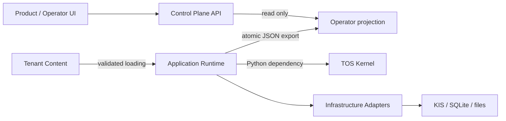

# TOS system context and layer ownership

기준: 2026-10-06, repository HEAD `5c4f38e9`. 이 문서는 현재 계층 명명의 정본이다.
명명과 책임을 정리하며 기존 규범·방화벽·실행 권한을 개정하지 않는다.
운영 프로세스와 브로커 접속은 이번 문서 작업에서 확인하지 않았다.

## 1. 공식 명칭과 책임

| 공식 명칭 | 소유 경로 | 책임과 경계 |
|---|---|---|
| TOS Kernel | `tos/src/tos/` | 결정·권한·위험·증거·전송 판정의 커널 타입, Protocol, 상태 전이. 제품 HTTP/UI를 소유하지 않는다. |
| Application Runtime + Infrastructure Adapters | `tos/runtime/src/tos_runtime/` | `compose`에서 커널과 구현체 결선; event driver, 복구·대사, 시간·시세·SQLite·custody·transport, 운영 CLI. 별도 배포 패키지 `tos-runtime`. |
| Control Plane API (BFF) | `services/dashboard/`의 TOS 표면 | 현재 projection 파일을 읽는 `GET /api/tos/projection`. 기존 dashboard 전체를 TOS 전용 API로 간주하지 않는다. |
| Product / Operator UI | `strategy-builder-ui/` | 운영자가 상태·실험·전략을 보는 제품 표면. TOS 전용 projection 화면은 후속 작업. |
| Tenant Content | `config/tos_runtime/paper/`, `tos/runtime/config/`, 향후 tenant 산출물 | DSL 전략, construction/policy 설정, broker profile 참조. 실행 권한과 별개인 버전 관리 콘텐츠. |
| Legacy Runtime and Research Tools | `shared/`, `services/`, `cli/`, 기존 전략 설정 | 기존 실행 경로 및 연구·백테스트·데이터 도구. 기능별 처분은 이관 표가 관리한다. |

외부 KIS·파일시스템·SQLite는 런타임 어댑터가 접근하는 인프라다.
커널 아래에 구체 인프라를 import하는 계층을 두는 것으로 해석하지 않는다.

UI→API는 제품의 일반 경로이며 TOS 조회 화면은 아직 연결되지 않았다.
Control Plane→Runtime 명령 ingress는 현재 미구현이다.

## 2. 허용 의존 방향

- `tos_runtime → tos`: 허용. composition root는 `tos_runtime.compose` 한 곳.
- `tos → tos_runtime`: 금지. `tos/` 밖 코드가 둘 중 하나를 import하는 것도 금지.
- `tos_runtime → shared.*`: 전부 금지. 커널에만 여섯 pure-commons 예외가 있다.
- Dashboard→projection: 파일을 통한 읽기. dashboard에서 runtime 객체/DB를 직접 조작하지 않는다.
- 전략·상품 지식은 DSL/profile/config로 재저작한다. 레거시 executor/KIS/service 복사는 금지.
- repo 분리는 기존 live-gate 재검토 조건을 따른다. TOS를 새 repo로 이동하지 않는다.

정본: [boundary design §3·§6](../plans/2026-07-20-tos-boundary-and-import-firewall-design.md),
[runtime D1](../plans/2026-09-07-tos-phase2-runtime-shell-preliminary-decisions.md),
[실제 검사기](../../tools/tos_firewall_check.py), [import-linter](../../.importlinter).
이 문서와 규범이 충돌하면 기존 규범을 따르고 이 문서를 정정한다.

## 3. 현재 구현과 남은 경계

[composition root](../../tos/runtime/src/tos_runtime/compose/root.py)와
[CLI dispatcher](../../tos/runtime/src/tos_runtime/compose/cli.py)는 구현돼 있다.
synthetic과 KIS mock 전송 선택은 구현됐지만 실전 전송 승인과 동일하지 않다.
[운영 런북](../runbooks/tos-paper-boot.md)은 상주 paper·월물별 data dir·롤 동작을 기록한다.
해당 기록이 오늘의 실행 성공을 자동으로 증명하지는 않는다.

제품 연결은 schema v1 projection 생산자와 dashboard 소비자까지다.
UI 연결, 공통 스키마 산출물, freshness 정책, 배포 경로 검증, 알림 전달의
end-to-end 증거와 명령 ingress는 후속 범위다. 공개/내부 경계는
[인터페이스 카탈로그](tos-public-interfaces.md)를 따른다.

## 4. 정리와 이행 문서의 역할

- [Legacy disposition](../migration/legacy-disposition.md): 기존 규범 레지스터를 참조하는 기능별 처분·전환 작업표.
- [Control Plane / first tenant 계획](../plans/2026-10-06-tos-control-plane-and-first-tenant-plan.md): 새 개발 순서와 완료 조건.
- [Project status](../PROJECT_STATUS.md): 현재 구현·검사·미확인 운영 상태.
- [ROADMAP](../ROADMAP.md): 기존 Cross-Asset/Stock/Futures 전략 로드맵. 새 계획은 TOS 통합 범위에 한정한다.

실전 선물 주문과 증거금 투입은 정책상 금지다. 이 문서의 cutover는 우선
paper scope에 한정하며 live 승격을 완료 조건으로 삼지 않는다.
